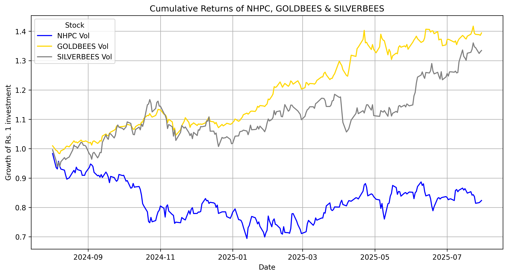

# **NHPC Gold & Silver ETF Analysis**

## Overview

This project explores the relationship between **NHPC Limited (NHPC.NS)** and the commodity-backed ETF, **GOLDBEES.NS** and **SILVERBEES.NS**, over the period **August 2024** to **July 2025**.

The goal is to understand how NHPC's performance correlates with gold and silver, while also analyzing its volatility and trend behaviour.

The analysis includes:

- Cumulative Returns
- Technical Indicators (SMA & EMA)
- Rolling Volatility (20-day)
- Correlation of Gold & Silver ETFs (Rolling 60-day)
  
---

## Data Source:

- Yahoo Finance (yfinance) API
- Period: 1st August, 2024 - 31st July, 2025
- Assets analyzed:
  - NHPC.NS (NHPC Limited)
  - GOLDBEES.NS (Gold ETF)
  - SILVERBEES.NS (Silver ETF)

---

## Methods & Analysis

1. Cumulative Returns
- Growth of ₹1 investment in NHPC, Gold, and Silver.
- Helps compare relative performance.

  

2. Rolling Volatility (20-day)
- Measured standard deviation of returns.
- Highlights periods of high vs. low market uncertainty.

3. SMA & EMA (20-day)
- Simple Moving Average (SMA) and Exponential Moving Average (EMA) compared against the stock price.
- Used for trend detection.

4. Rolling Correlation (60-day)
- Correlation of NHPC with Gold and Silver ETFs.
- Helps assess whether NHPC behaves more like an equity stock or tracks commodity movements.

---

## Key Observations

- NHPC shows relatively stable cumulative returns compared to Gold and Silver ETFs.
- Gold ETF tends to have lower volatility, while Silver ETF is more volatile.
- SMA and EMA trends show how the NHPC price reacts around its averages.
- Rolling correlation reveals changing relationships between NHPC and precious metals, useful for portfolio diversification.

---

## Tools Used

- Python: yfinance, pandas, matplotlib, seaborn
- Jupyter notebook
  

