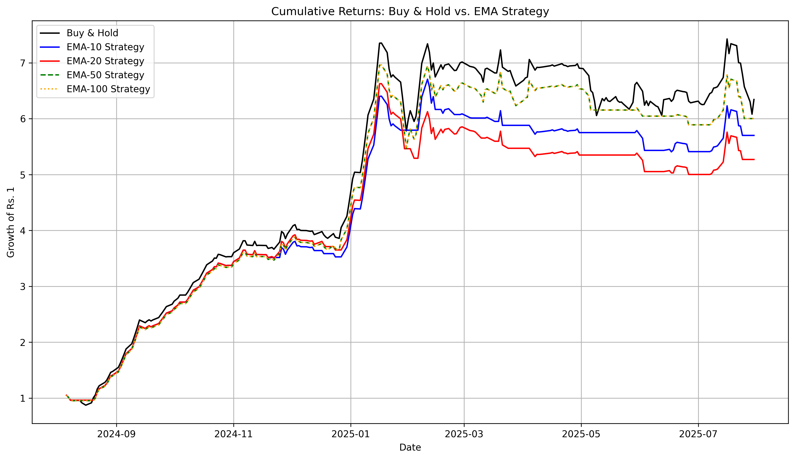
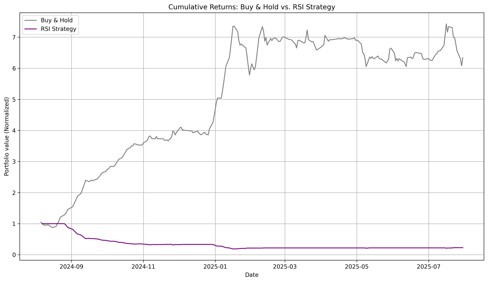
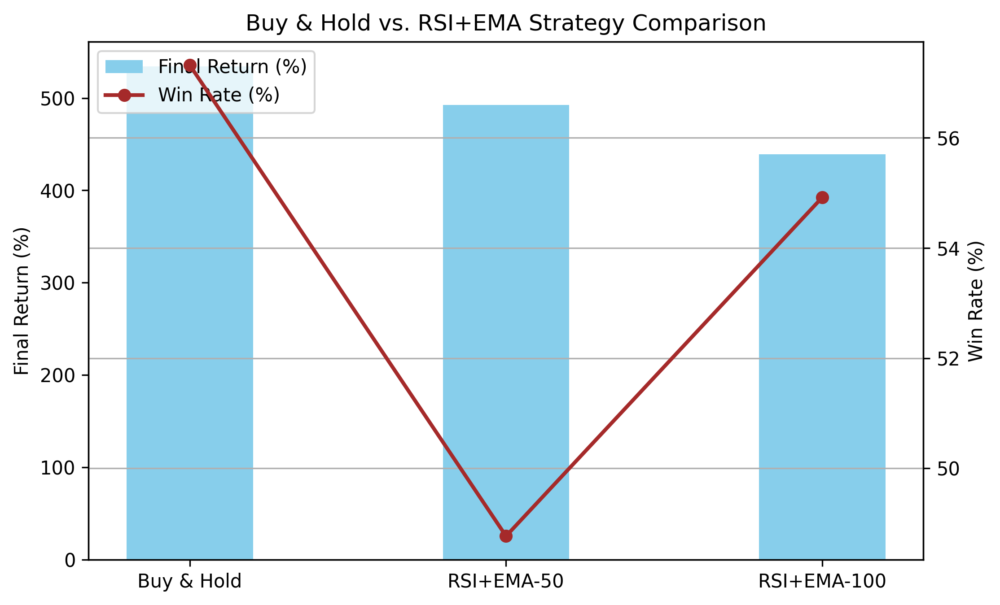
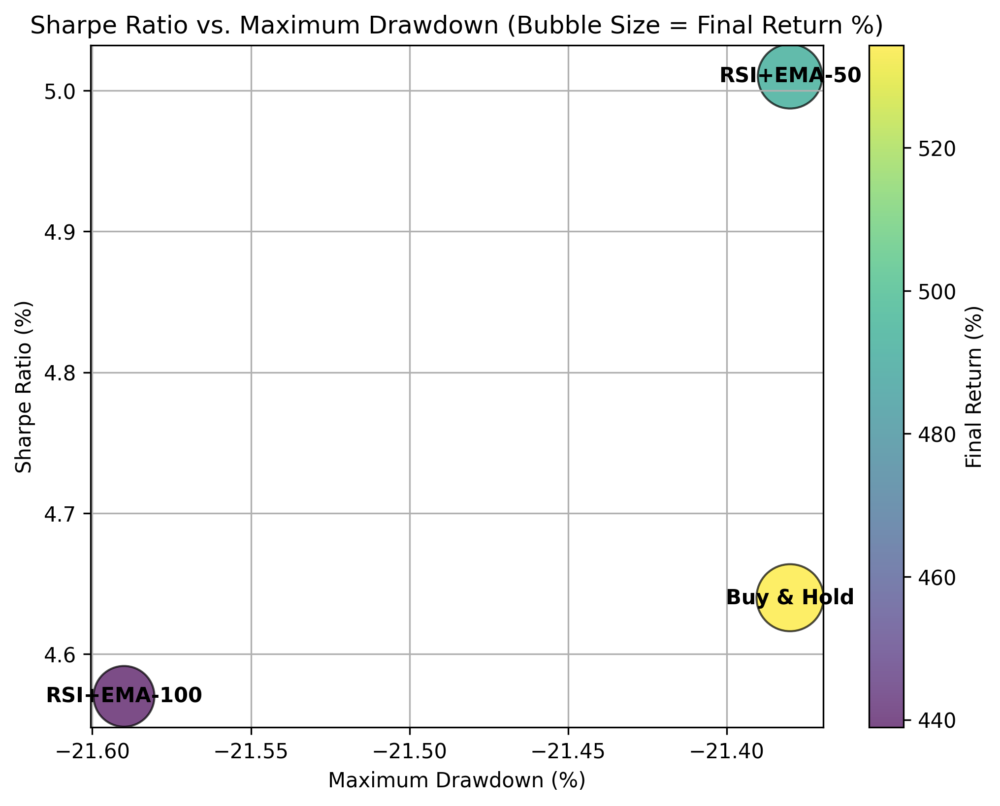
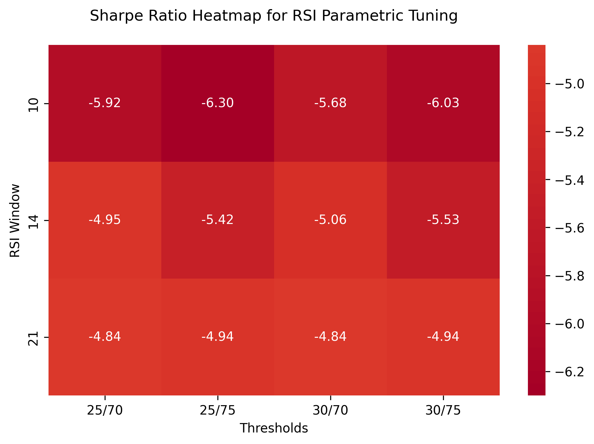
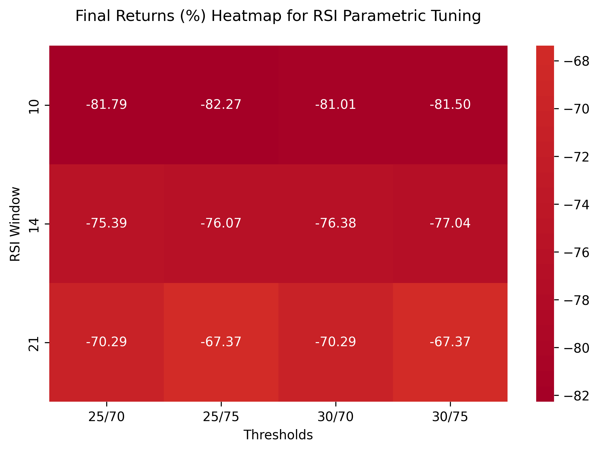

# RSI & EMA-based Trading Strategy Backtesting for Indo Thai Securities

This project explores systematic trading strategies on **Indo Thai Securities (INDOTHAI.NS)** using **Python**. We test multiple approaches (Buy & Hold, EMA, RSI, and hybrid strategies), evaluate performance, and tune parameters. The analysis is implemented in a **Jupyter Notebook** with visualizations, metrics, and strategy comparisons.

---

## Project Overview

The goal is to evaluate the effectiveness of technical analysis indicators:
- **Buy & Hold**: benchmark strategy
- **Exponential Moving Averages (EMAs)**: trend-following signals
- **Relative Strength Index**: momentum-based signals
- **Hybrid RSI+EMA Strategy**: combines trend and momentum

---

## Strategies Tested

- **Buy & Hold**: baseine comparison
- **EMA only strategies**: EMA (10, 20, 50, 100)

  

- **RSI (14-day)**: momentum entry/exit

  

- **RSI+EMA Hybrid**: comnined filter with EMA-50 and EMA-100

  

  

---

## Performance Metrics

We calculate:
- **Final Return (%)**
- **Maximum Drawdown**
- **Annualized Sharpe Ratio**
- **Win/Loss Days (%)**

  

  

## Results

| Strategy    | Final Returns (%) | Max Drawdown | Sharpe Ratio | Win % | Loss % |
|-------------|-------------------|--------------|--------------|-------|--------|
| Buy & Hold  | 534.33            | -21.38%      | 4.64         | 57.32 | 41.06  |
| EMA-10      | 470.05            | -19.38       | 5.24         | 41.87 | 23.17  |
| EMA-20      | 427.00            | -24.53       | 4.74         | 44.31 | 26.83  |
| EMA-50      | 500.17            | -21.38       | 4.96         | 48.78 | 30.89  |
| EMA-100     | 500.17            | -21.38       | 4.96         | 48.78 | 30.89  |
| RSI-14      | -77.20            | -81.25       |-5.15         | 10.20 | 26.12  |
| RSI+EMA-50  | 492.39            | -21.38       | 5.10         | 48.77 | 30.74  |
| RSI+EMA-100 | 438.93            | -21.59       | 4.57         | 54.92 | 39.34  |
                                                                                   (Data as of 18 August 2025)
---

## Parameter Tuning

Grid search was performed across:
- **RSI Windows**: 10, 14, 21
- **RSI Thresholds**: (25/75), (30/70)
- **EMA spans**: 10, 20, 50, 100

  

  

This helped identify optimal parameter combinations.

---

## Observations

- **EMA strategies** smoothed volatility and improved risk-adjusted returns compared to Buy & Hold
- **RSI alone** performed poorly, highlighting risks of over-reliance on momentum
- **EMA-50** and **EMA-100** overlapped visually, so RSI hybrids were tested with both separately
- **RSI+EMA hybrid strategies** delivered the best **Sharpe Ratio (~5%)** with controlled drawdowns
- Parameter tuning showed sensitivity to thresholds, but reaffirmed EMA's stabilizing role

---

## How to run?

1. Clone this repo
````bash
git clone https://github.com/your-username/your-repo-name.git

2. Installation requirements

pip install -r requirements.txt

3. Launch Jupyter Notebook

jupyter notebook

4. Open and run simulation_main.ipynb
